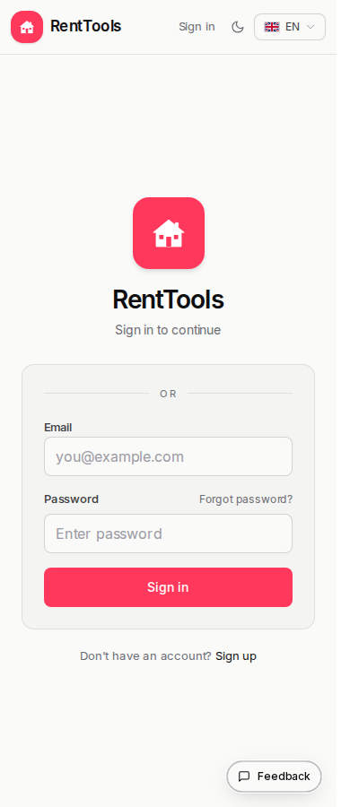
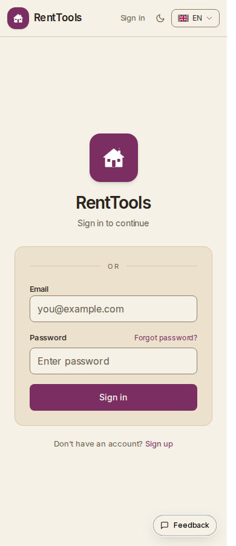
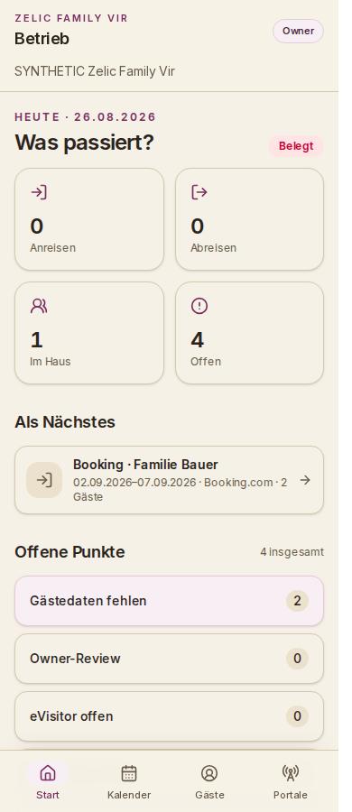
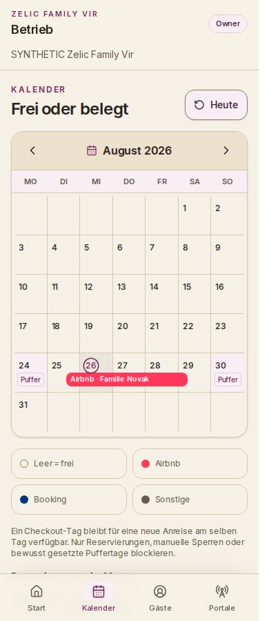
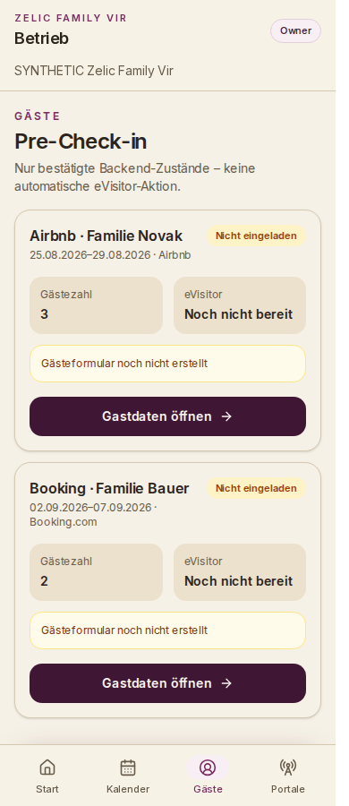
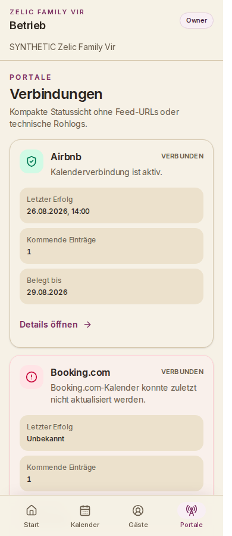

# Zelic Family Vir brand color alignment

This evidence set documents the color-only alignment of RentTools with the
Zelic Family Vir palette. Layout, spacing, typography, navigation, content,
and application behavior are unchanged.

## Design authority

- Repository: `zelic1991/zelic-family-vir`
- Commit: `7f532eeb4dc96d516b0a2734116e2f83317510e5`
- Source: `src/styles/tokens.css`
- App background: `#F6F1E6`
- Primary brand: `#7B2E62`
- Brand dark: `#3F1735`
- Primary text: `#2B241D`

Semantic success, warning, and error colors remain unchanged. Airbnb and
Booking channel colors also remain unchanged.

## Login before and after at 390 px

| Before (production) | After (local production build) |
| --- | --- |
|  |  |

## Mobile after at 390 px

| Start | Calendar |
| --- | --- |
|  |  |

| Guests | Portals |
| --- | --- |
|  |  |

The local production build passed the same visual and overflow checks at 320,
360, 375, 390, 412, and 430 px. It also passed desktop smoke checks at 1440 px.
All mobile screenshots use local synthetic fixture data.

Authenticated production mobile baseline images were intentionally not
captured at the Owner's direction; the Owner will compare those live pages
during visual review. The public production login baseline is included above.
